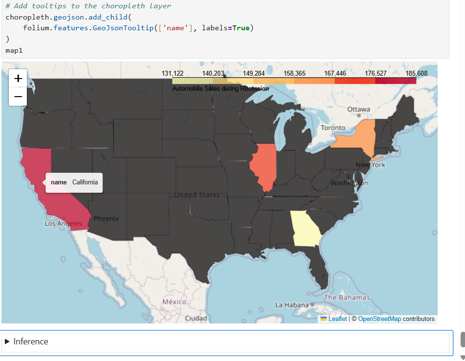

# 🚗 Automobile Sales Analytics Dashboard

🔗 **Live Demo:** https://automobile-salesanalysis.onrender.com/

An interactive dashboard built using **Python, Dash, and Plotly** to analyze automobile sales trends across recession and non-recession periods.

---

## 📊 Project Overview

This project analyzes how macroeconomic factors like **GDP, unemployment rate, consumer confidence, and seasonality** impact automobile sales.

Users can dynamically switch between:

- 📈 Yearly Statistics
- 📉 Recession Period Analysis

using interactive dropdowns powered by Dash callbacks.

---

## ⚙️ Tech Stack

- Python
- Dash
- Plotly
- Pandas
- Folium

---

## ✨ Key Features

- Interactive dropdown filters
- Dynamic graph updates (Dash callbacks)
- Recession vs Non-recession comparison
- Multiple visualizations (line, bar, pie charts)
- Live deployed dashboard

---

## 🔍 Key Insights & Findings

### 📌 1. Sales vs Advertising

Automobile sales are more volatile than advertising during non-recession periods. Sales spikes often occur independently, indicating strong influence from external factors like demand and economic conditions.

---

### 📉 2. Recession Impact

There is a **drastic decline in automobile sales during recession periods**.
Executive and sports cars are the most affected segments.

---

### 📊 3. GDP Behavior

GDP is lower and more volatile during recessions, reflecting economic instability.
Non-recession periods show relatively stable growth.

---

### 📅 4. Seasonality

Seasonality has minimal overall impact, but **sales peak in April and December**, indicating strong seasonal buying patterns.

---

### 💰 5. Consumer Confidence & Pricing

Higher consumer confidence leads to increased sales, while higher vehicle prices reduce demand.
Affordability plays a critical role during downturns.

---

### 📢 6. Advertising Strategy

Companies increase advertising spend during non-recession periods, leveraging favorable market conditions.

---

### 🎯 7. Smart Marketing During Recession

During recessions, companies shift focus to **low-price vehicles**, targeting cost-conscious customers.

---

### 📉 8. Unemployment vs Sales

Automobile sales decline as unemployment rises, with sharp drops beyond 3%.
Entry-level vehicles show higher sensitivity to economic changes.

---

### 🌎 9. Regional Sales Distribution

Sales distribution across 4 different U.S. branches varies during recession, highlighting regional demand differences with help of folium


---

## 🚀 How to Run Locally

```bash
pip install -r requirements.txt
python app.py
```

Open: http://127.0.0.1:8050/

---

## 🌐 Deployment

This project is deployed on Render for public access.

---

## 📌 Conclusion

This project demonstrates:

- Building interactive dashboards using Dash
- Applying data filtering and aggregation
- Extracting business insights from data
- Deploying real-world data applications

---

## 👨‍💻 Author

Navaneet SV

---

⭐ If you like this project, give it a star!
